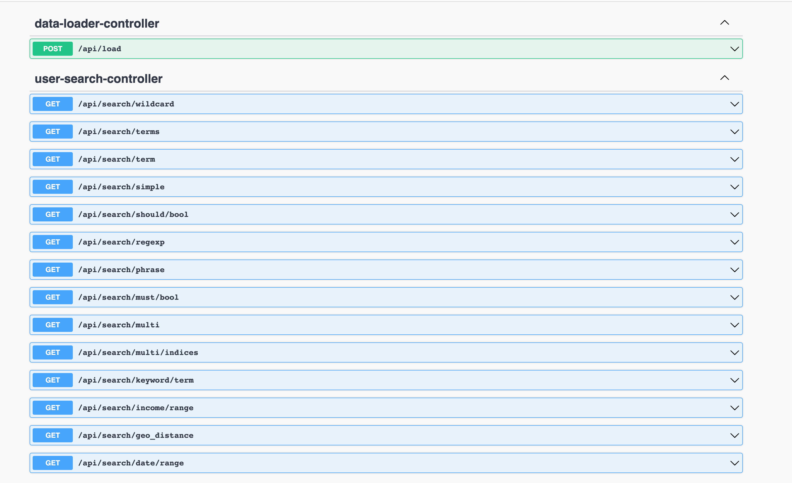

# Elastic Search Demo - Load Data in to Elastic Search

This is a spring boot application had an rest endpoint to post random data onto elastic search. The infra is on docker.

### Start Elastic search and Kibana
``` shell
$ docker-compose up-d
wait for some time after check status 
$ docker-compose ps
        Name                       Command               State                         Ports
-------------------------------------------------------------------------------------------------------------------
elastic                 /usr/local/bin/docker-entr ...   Up      0.0.0.0:9200->9200/tcp,:::9200->9200/tcp, 9300/tcp
elastic-demo_kibana_1   /usr/local/bin/kibana-docker     Up      0.0.0.0:5601->5601/tcp,:::5601->5601/tcp
```
The elastic search is in 9200 and kibana on 5601 port, To go to kibana developer console please navigate to this location -> http://localhost:5601/app/kibana#/dev_tools/console?_g=() , Here you can execute the queries.

### Open Api Endpoints
I have enabled Open-Api endpoints. Please visit http://localhost:9001/swagger-ui/index.html?configUrl=/v3/api-docs/swagger-config



You can find an POST API to load data into local elastic search instance. The api generated Random data and adds into elastic search.

Note: Before that create indices in elastic search for proper data storage as per schema defined.

``` shell
curl -d "@src/main/resources/es/user_index.json" -XPUT "http://localhost:9200/user" -H 'Content-Type: application/json'
{"acknowledged":true,"shards_acknowledged":true,"index":"user"}

curl -d "@src/main/resources/es/user_address_index.json" -XPUT "http://localhost:9200/user_address" -H 'Content-Type: application/json'
{"acknowledged":true,"shards_acknowledged":true,"index":"user_address"}
```
Now you could see two indices in kibana dev console with the help of `GET _cat/indices`.

### Load Data into Elastic Search
``` shell
curl -XPOST http://localhost:9001/api/load\?size\=50000  
```
#### Note: There is a limitation for post bulk, 50000 is the safer batch size for elastic search. Bases on your system configuration it will take some time. For me it took ~18 seconds to upload 50K data.

Then you all set. You can explore the apis that already existed in the code base or experiment the same with kibana developer console.

### Logging search query
I had enabled logging, so you can see the query in the console

``` json
Search JSON query: {"from":0,"size":10,"query":{"geo_distance":{"point":[79.7397,15.684453142518711],"distance":1000.0,"distance_type":"arc","validation_method":"STRICT","ignore_unmapped":false,"boost":1.0}}}
```

